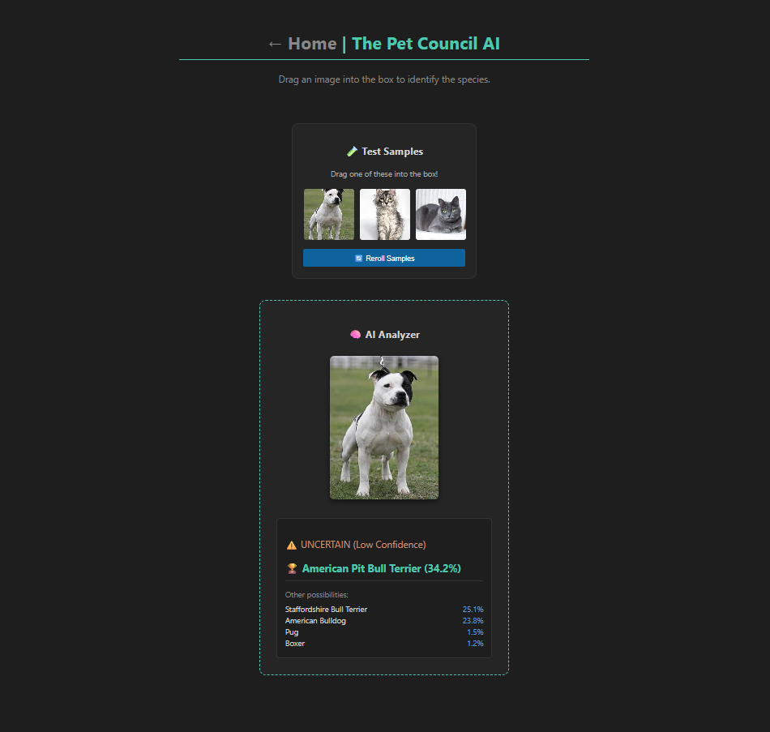

# 🐾 The Pet Council AI

**A robust, ensemble deep learning classifier for pet breed detection.**
*Built with PyTorch, Flask, and Docker.*



---

## 📖 The Story
This project was born from a specific failure: standard AI models consistently confused **Grey Sphynx cats** with **Russian Blues**. The shape was correct, but the color bias was too strong.

To solve this, I engineered **"The Pet Council"**—an ensemble system that doesn't rely on a single opinion. instead of one "arrogant" AI, this system uses two distinct architectures and a rigorous voting process to achieve "calibrated uncertainty."

## 🚀 Key Features

* **🧠 Dual-Brain Architecture:** Combines the efficiency of **EfficientNet-B0** with the depth of **ResNet50**.
* **👁️ Test Time Augmentation (TTA):** The AI doesn't just look once. It scans every image **8 times** (Original, Flip, Rotate, Crop) across both brains before making a decision.
* **⚖️ The "Council" Voting System:** Results are averaged to eliminate outliers. If the Council is split, the system reports **"UNCERTAIN"** rather than guessing blindly.
* **💻 Interactive UI:** Full-stack Flask application with Drag-and-Drop functionality and a dynamic sample pool.
* **🐳 Dockerized:** Fully containerized for easy deployment anywhere.

---

## 🛠️ Tech Stack
* **Core AI:** Python 3.11, PyTorch, Torchvision
* **Architectures:** EfficientNet, ResNet
* **Backend:** Flask (Web Server)
* **Frontend:** HTML5, CSS3, JavaScript (Drag & Drop Logic)
* **Deployment:** Docker

---

## ⚙️ How It Works
1.  **Input:** Image is uploaded via Drag-and-Drop.
2.  **Preprocessing (TTA):** The image is duplicated and transformed into 4 versions:
    * *Standard*
    * *Horizontal Flip*
    * *Rotation (15°)*
    * *Zoom/Crop*
3.  **Inference:**
    * **Brain 1 (EfficientNet)** analyzes all 4 versions.
    * **Brain 2 (ResNet50)** analyzes all 4 versions.
4.  **Consensus:** The 8 probability vectors are averaged.
5.  **Verdict:** The final confidence score is calculated. If the top score is <40%, the system flags it as "Uncertain."

---

## ⚡ Quick Start

### Option A: Run with Docker (Recommended)
This is the easiest way to run the application without installing Python dependencies manually.

```bash
# 1. Build the container
docker build -t pet-council .

# 2. Run the application
docker run -p 5000:5000 pet-council